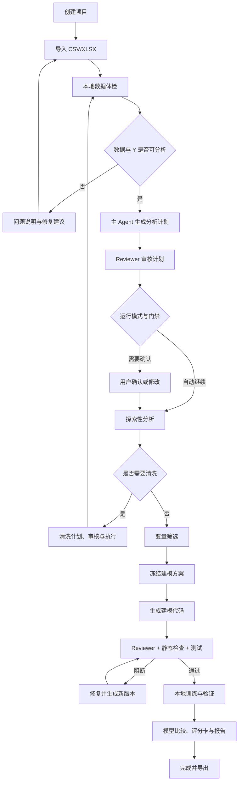

# 02｜用户流程与状态机

- 文档版本：v1.0
- 日期：2026-08-20
- 目标：定义用户旅程、运行状态、门禁、失效与恢复规则

## 1. 设计原则

1. 项目状态以本地结构化数据为事实源，不以聊天记录为事实源。
2. LangGraph 负责编排和 checkpoint，不直接修改未经领域服务校验的业务事实。
3. 每个节点只有明确输入、允许工具、输出和终止条件。
4. 数据、Y、样本、清洗、变量或模型计划变化时，受影响的下游结果自动失效。
5. 自动运行模式可以减少确认，但不能跳过硬门禁。
6. 页面刷新、应用重启和可恢复错误不应让用户重新开始整个项目。

## 2. 核心对象

| 对象 | 含义 |
|---|---|
| Project | 一个独立建模项目，绑定数据、会话、决策和运行 |
| DatasetVersion | 一次不可变的数据导入或清洗结果 |
| Conversation | 项目内多轮对话，关联当前状态和运行 |
| ModelPlan | 已版本化的 Y、样本、变量、切分、模型和报告方案 |
| Run | 按一个冻结方案执行的一次完整运行 |
| NodeRun | Run 内某节点的一次尝试 |
| Decision | 用户或策略做出的结构化确认 |
| ToolCall | Agent 发起的工具调用记录 |
| Artifact | 画像、表格、代码、模型、指标和报告等不可变产物 |
| Trace | 可导出的状态、Agent、工具与产物事件流 |

## 3. 端到端流程

## 4. 项目状态

| 状态 | 含义 | 可执行动作 |
|---|---|---|
| `draft` | 项目已创建，无数据 | 导入数据、删除空项目 |
| `data_imported` | 文件已校验并绑定版本 | 启动画像、重新导入 |
| `profiling` | 本地画像运行中 | 查看进度、取消 |
| `profile_ready` | 画像产物可用 | 选择/确认 Y、生成分析计划 |
| `data_blocked` | 数据契约存在阻断 | 修改口径、重新导入或终止 |
| `plan_reviewing` | 主 Agent 与 Reviewer 正在审查计划 | 查看进度、取消 |
| `awaiting_confirmation` | 存在用户业务确认 | 确认、修改、追问 |
| `eda_running` | 探索性分析运行中 | 查看进度、暂停/取消 |
| `cleaning_review` | 清洗计划待审核或确认 | 采纳、修改、拒绝 |
| `cleaning` | 本地执行清洗 | 查看进度、取消 |
| `screening` | 变量分阶段筛选 | 查看进度、修改后重跑 |
| `plan_frozen` | 数据与建模方案已冻结 | 生成代码、创建新方案版本 |
| `code_generating` | Code Agent 生成代码 | 查看流式状态、取消 |
| `code_reviewing` | Reviewer 与确定性检查运行 | 查看问题、等待修复 |
| `repairing` | 根据审核结果生成新代码版本 | 查看差异、取消 |
| `approved_for_training` | 所有训练前门禁通过 | 启动训练 |
| `training` | 本地训练候选模型 | 查看进度、取消 |
| `validating` | 比较、留出评估与报告校验 | 查看进度 |
| `completed` | 本次 Run 成功完成 | 查看、导出、派生新方案 |
| `failed` | 当前尝试失败且未完成 | 查看错误、按条件重试 |
| `cancelled` | 用户取消 | 从安全节点创建新尝试 |

## 5. 节点状态

每个 `NodeRun` 独立记录：

- `pending`：等待调度；
- `running`：正在执行；
- `awaiting_review`：等待 Reviewer；
- `awaiting_confirmation`：等待用户；
- `blocked`：硬门禁未通过；
- `succeeded`：输出已校验并保存；
- `failed`：执行失败；
- `cancelled`：用户或系统取消；
- `superseded`：因上游变化被新版本取代。

## 6. 自动运行与半信任模式

“自动运行模式”对应需求讨论中的“完全信任模式”，但它只减少业务确认，不代表关闭系统硬门禁。

| 决策点 | 自动运行模式 | 半信任模式 |
|---|---|---|
| Y 与 0/1 含义 | 无法可靠确定时阻断 | 必须确认 |
| 样本切分 | 按已配置策略自动；歧义时阻断 | 必须确认 |
| 字段排除 | 高置信硬规则自动；语义歧义阻断 | 展示摘要并确认 |
| 清洗 | 低风险规则自动 | 展示影响并确认 |
| 变量筛选 | 按版本化策略自动 | 确认规则与最终集合 |
| 模型集合 | 按项目策略自动 | 必须确认 |
| Reviewer `warn` | 记录后可按策略继续 | 展示后确认 |
| Reviewer `block` | 必须修复或停止 | 必须修复或停止 |

两种模式共同的不可跳过阻断：

- Y 不是明确 0/1 或缺少任一类别；
- 目标窗口、观察窗口或决策时间无法建立基本一致性；
- 命中高置信贷后泄漏；
- 生成代码存在危险行为；
- 静态检查、本地测试或产物一致性检查失败；
- 数据或方案哈希与批准记录不一致。

## 7. 关键确认卡

半信任模式至少包含五类结构化确认：

1. Y、0/1 含义和样本范围；
2. 切分方式、时间字段和留出比例；
3. 排除字段与泄漏风险；
4. 清洗和变量筛选规则；
5. 候选模型、评分卡路线和计算预算。

确认卡必须包含：建议、依据、影响范围、风险、Reviewer 结论和可编辑项。确认不是点赞；点赞只评价回复是否有帮助。

## 8. 失效规则

| 变化 | 必须失效的下游内容 |
|---|---|
| 原始文件或关联方式变化 | 全部画像、方案、代码、模型、报告 |
| Y 字段或 0/1 含义变化 | 样本切分之后的全部内容 |
| 时间字段或样本范围变化 | 切分、筛选、代码、模型、报告 |
| 清洗规则变化 | 清洗后的画像、筛选、代码、模型、报告 |
| 排除字段或筛选规则变化 | 最终变量集、代码、模型、报告 |
| 模型集合或参数预算变化 | 代码、模型比较、报告 |
| Prompt/Agent/工具实现变化 | 新 Run 使用新版本；旧 Run 保留但不可混合 |

失效只改变“当前可用性”，不删除历史产物。用户可以查看旧版本，但界面必须明确标记“已被新方案取代”。

## 9. Reviewer 修复循环

1. 主 Agent 或 Code Agent 生成不可变产物版本。
2. Reviewer 读取方案、代码、安全证据和确定性检查结果。
3. Reviewer 返回结构化问题。
4. `warn` 按模式处理；`block` 生成 `RevisionRequest`。
5. Code Agent 生成新版本，不覆盖旧版本。
6. 重跑 Reviewer、静态检查与测试。
7. 最多自动修复三轮；仍阻断则停止并说明原因。

Reviewer 不直接写正式代码、不启动训练，也不能批准自己的输出。

## 10. 暂停、恢复和取消

- 只有已持久化的节点边界可作为恢复点。
- 长任务定期写入进度，但进度不等于完成产物。
- 恢复前校验数据、方案、工具和代码版本是否仍匹配。
- 取消必须向本地 Worker 发送取消信号，并把未完成产物标记为临时或无效。
- 应用崩溃后不得自动把 `running` 当作成功；需进入恢复检查。

## 11. 错误分类

| 类型 | 示例 | 默认处理 |
|---|---|---|
| 用户可修复 | Sheet 错误、Y 选择错误 | 展示修改入口 |
| 数据阻断 | 单类别、严重泄漏 | 停止流程 |
| LLM 可重试 | 超时、结构化输出无效 | 有限重试并保留错误 |
| Worker 可重试 | 临时文件占用 | 从安全节点重试 |
| 资源不足 | 内存预测超限 | 降级、分块或停止 |
| 安全阻断 | 危险代码、越权路径 | 不重试执行，要求修复 |
| 一致性失败 | 页面与报告指标不一致 | 阻断完成状态 |

## 12. 页面状态文案原则

- 使用“正在分析 1,842/20,000 个字段”，不使用无限转圈。
- 使用“未发现阻断问题”，不声称“代码绝对没问题”。
- 使用“离线留出集结果”，不声称“生产效果”。
- 明确“等待用户确认”“等待 Reviewer”“本地 Worker 运行中”的区别。
- 失败状态提供原因、影响、可恢复动作和错误编号。
