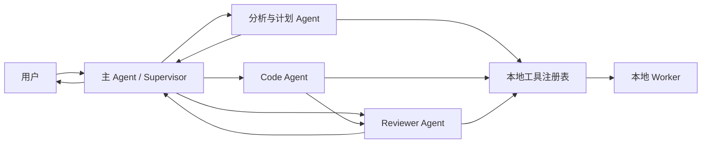

# 03｜Agent 角色与协作协议

- 文档版本：v1.0
- 日期：2026-08-20
- 目标：定义 Agent Runtime、角色边界、通信、上下文、权限和审核闭环

## 1. 架构结论

V1 采用“LangGraph 编排 + 领域状态机 + 外部 LLM API + 本地 Worker”的混合架构。

- LangGraph 负责节点、路由、循环、checkpoint、暂停恢复和流式事件。
- 本地 SQLite/领域服务保存项目、数据、决策、运行和产物事实。
- LLM Agent 负责语义理解、计划、解释、代码生成和审核。
- Worker 负责确定性数据与模型计算。
- 不采用完整 LangChain 全家桶；只在确有价值时使用最小模型/工具接口。
- Pi Agent 不作为产品主运行时；若未来评估其代码 Agent 能力，只能作为隔离的可替换组件。

## 2. 为什么不是“多个 Agent 自由聊天”

自由聊天会产生三个问题：状态难以确定、反馈难以执行、责任难以审计。V1 使用中央 Orchestrator 管理通信：



所有 Agent-to-Agent 消息都必须：

- 绑定 `project_id`、`run_id`、`state_version`；
- 引用不可变的方案、代码和证据版本；
- 使用结构化 Schema；
- 写入脱敏 Trace；
- 由 Orchestrator 决定下一条状态迁移。

## 3. Agent 角色

### 3.1 主 Agent / Supervisor

职责：

- 维护用户多轮交互；
- 识别当前目标与项目状态；
- 把任务分派给专业 Agent 或工具；
- 汇总证据、Reviewer 反馈和用户决策；
- 根据状态机推进、暂停、重试或阻断；
- 向用户提供可验证的结论和下一步。

禁止：

- 直接读取原始数据行；
- 自己计算 IV、AUC、KS 等确定性指标；
- 绕过 Reviewer 或安全门禁；
- 直接执行生成代码；
- 作出授信业务决定。

### 3.2 分析与计划 Agent

职责：

- 根据本地安全证据理解字段、Y、时间和样本问题；
- 生成探索性分析、清洗、变量筛选和建模计划；
- 将自然语言分析需求转换成 `AnalysisSpec`；
- 解释本地 Worker 结果并标注不确定性。

禁止：

- 获取客户级原始记录；
- 把业务含义不明确的字段自动判定为可用；
- 使用留出/OOT 结果反复调整筛选规则。

### 3.3 Code Agent

职责：

- 从已冻结 `ModelPlan` 生成可复现 Python 代码；
- 使用允许的库、模板和本地工具 API；
- 根据 `RevisionRequest` 生成新代码版本；
- 输出代码说明和依赖清单。

禁止：

- 自行改变 Y、样本、字段、切分或模型集合；
- 使用 `eval`、`exec`、动态下载、任意 Shell 或网络请求；
- 写入受控项目目录以外的路径；
- 覆盖已审核代码版本。

### 3.4 Reviewer Agent

职责：

- 独立审核 `ModelPlan` 与代码；
- 检查目标泄漏、训练/验证污染、错误指标、隐式样本变化；
- 检查清洗、编码、分箱、切分和随机种子；
- 结合静态检查、单测和运行证据给出结论；
- 输出明确的修复要求和建议测试。

权限：

- 只读方案、代码、安全证据和测试结果；
- 可调用只读代码分析工具；
- 不可修改正式代码、启动训练、写入模型或批准自身输出。

## 4. Agent 数量控制

V1 不为每个小步骤创建 Agent。只在以下条件同时成立时拆分角色：

- 任务需要不同系统提示和工具权限；
- 角色输出可用结构化合约验收；
- 独立上下文能降低关联错误；
- 拆分后的运行成本和延迟可接受。

画像、IV、PSI、训练和报告属于工具/Worker，不属于 Agent。以后如增加专业 Reviewer，可以在不改变业务状态模型的前提下扩展。

## 5. 结构化通信

### 5.1 TaskPacket

主 Agent 向专业 Agent 发出任务：

```json
{
  "schema_version": "risk-agent.task/v1",
  "project_id": "proj_xxx",
  "run_id": "run_xxx",
  "state_version": 12,
  "task_id": "task_xxx",
  "task_type": "review_model_code",
  "artifact_refs": ["artifact://model-plan/v3", "artifact://code/v2"],
  "evidence_refs": ["evidence://profile/v4"],
  "constraints": {
    "raw_data_access": false,
    "network_access": false,
    "write_access": false
  }
}
```

有效权限 = 角色权限 ∩ TaskPacket `constraints`。任何角色都不能通过任务包扩大自己的权限；`raw_data_access=false`、`network_access=false` 和 `write_access=false` 是默认硬约束。

### 5.2 ReviewResult

Reviewer 返回：

```json
{
  "schema_version": "risk-agent.review/v1",
  "task_id": "task_xxx",
  "reviewer_model": "configured-reviewer-model",
  "verdict": "block",
  "findings": [
    {
      "code": "VALIDATION_LEAKAGE",
      "severity": "block",
      "location": "feature_selection.py:84",
      "message": "IV 阈值使用了完整数据而非训练集。",
      "evidence_refs": ["artifact://code/v2"],
      "required_change": "仅使用训练分区拟合筛选规则，并增加回归测试。"
    }
  ],
  "recommended_tests": ["test_feature_selection_uses_train_only"]
}
```

### 5.3 RevisionRequest

Orchestrator 把 Reviewer 结论转换为 Code Agent 的修复任务：

```json
{
  "schema_version": "risk-agent.revision/v1",
  "source_artifact": "artifact://code/v2",
  "target_version": 3,
  "required_findings": ["VALIDATION_LEAKAGE"],
  "unchanged_contract_hash": "sha256:...",
  "max_scope": ["feature_selection.py", "tests/test_feature_selection.py"]
}
```

自由文本解释可以附加，但不能替代结构化字段。

## 6. 审核与修复策略

1. `pass`：没有阻断，且确定性检查通过，进入下一节点。
2. `warn`：记录风险；自动模式按策略继续，半信任模式交用户确认。
3. `block`：不得继续执行，必须生成修复版本或终止。
4. 每次修复产生新 `artifact_id` 和代码哈希。
5. 最多自动修复三轮，避免无限 Agent 循环和失控费用。
6. 连续失败时展示问题、已尝试修复、尚需决定的内容。

Reviewer 的措辞必须是“未发现阻断问题”，不能宣称“代码绝对安全”或“模型绝对正确”。

每个 Run 还必须携带 token/费用预算和模型路由策略。低风险字段分类、摘要任务可以使用低成本模型；方案审核和 Reviewer 使用配置的强模型。预算触顶时停止 LLM 调用或降级为确定性流程，不得静默超支。

## 7. 模型独立性

- 主 Agent 与 Reviewer 支持分别配置供应商、模型和系统提示。
- 如果只配置一个模型，Reviewer 使用独立会话和只读工具，但界面标记为“同模型二次审核”。
- 只有不同模型或不同供应商时，才可描述为“异构 Reviewer”；即便如此仍不是安全证明。
- 外部 API 统一通过 Provider Gateway，业务代码不绑定特定供应商 SDK。

项目对话由主 Agent 处理，使用当前 Run 的匿名 SafeEvidence 作为上下文；对话不能直接推进状态机。外部调用默认不接收用户原句，只接收本地识别出的结构化意图；疑似敏感值或无法归类的自由文本只返回确定性回复。报告叙事 Agent 只能基于已验证的结构化产物起草文字，不能计算或改写指标；专家编辑和锁定后，文本版本与证据引用进入报告产物。

## 8. 多轮上下文

每次 Agent 调用使用受控上下文组合：

1. 最近相关对话；
2. 经过验证的对话摘要；
3. 当前项目和运行状态；
4. 已确认的业务决定；
5. 与当前任务有关的安全证据；
6. 相关产物引用与 Reviewer 反馈。

不把整个数据库、全部聊天、原始 DataFrame 或所有历史产物一次性放入上下文。长期事实存于领域数据库；聊天摘要只用于帮助理解，不拥有更高优先级。

## 9. 用户反馈与正式确认

| 交互 | 含义 | 是否改变流程状态 |
|---|---|---|
| 点赞 | 回复有帮助 | 否 |
| 点踩 | 回复无帮助或错误 | 否，可附原因 |
| 追问 | 请求解释或证据 | 通常否 |
| 修改 | 生成新的结构化方案草稿 | 是，可能使下游失效 |
| 确认 | 批准一个具体决策版本 | 是 |
| 拒绝 | 否决当前建议 | 是 |
| 暂停/取消 | 控制运行 | 是 |

点赞和点踩可作为后续评测素材，但不会自动微调模型或批准业务动作。

## 10. 工具权限矩阵

| 工具类别 | 主 Agent | 分析 Agent | Code Agent | Reviewer |
|---|---:|---:|---:|---:|
| 状态读取 | 是 | 受限 | 受限 | 受限 |
| 安全证据读取 | 是 | 是 | 仅方案所需 | 是 |
| 画像/分析工具 | 通过委派 | 是 | 否 | 只读复核 |
| 代码生成暂存区 | 否 | 否 | 写 | 只读 |
| 静态检查/测试 | 调度 | 否 | 可请求 | 可请求 |
| 训练工具 | 调度 | 否 | 否 | 否 |
| 报告工具 | 调度 | 可请求 | 否 | 只读复核 |
| Shell | 否 | 否 | 否 | 否 |
| 网络 | 仅 Provider Gateway | 否 | 否 | 仅 Provider Gateway |
| 原始数据行 | 否 | 否 | 否 | 否 |

## 11. 可观察输出

页面和 Trace 展示：

- Agent 开始/结束；
- 任务类型和输入产物版本；
- 工具调用名称、状态、耗时和结果摘要；
- Reviewer 结论及问题列表；
- 修复版本和测试结果；
- 状态变化和下一步。

不展示模型隐藏思维链。用户看到的是依据、操作、结论、不确定性和可验证产物。

## 12. Prompt 与配置治理

- 系统提示、角色说明、输出 Schema 和工具清单均版本化。
- Prompt 修改创建新版本，不覆盖历史 Run 使用的版本。
- 生产配置不允许从前端提交任意系统提示。
- Provider 请求记录模型名、配置版本、Token、延迟、错误和安全证据哈希，不保存敏感原文。
