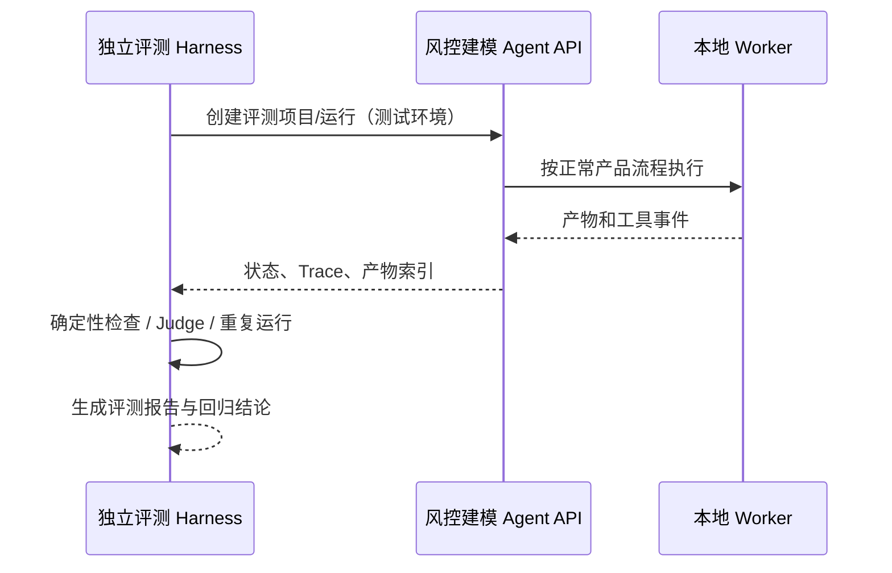

# 09｜Trace 与后续评测接入协议

- 文档版本：v1.0
- 日期：2026-08-20
- 目标：让当前产品便于未来评测，但不在当前产品中内置完整评测 Harness

## 1. 范围结论

当前产品不内置完整评测 Harness，只预留未来独立评测平台所需的接口与 Trace。

当前项目只建设：

- 运行标识；
- 状态和节点事件；
- Agent 与工具调用摘要；
- 产物、版本和哈希；
- 脱敏 Trace 导出接口；
- 可由测试环境触发的标准运行入口。

当前项目不建设：

- Golden/Bad Case 管理平台；
- 批量 Benchmark 调度；
- LLM-as-a-Judge；
- 人工标注与一致性平台；
- 模型/Prompt 排行榜；
- 回归看板和发布门禁平台。

这些能力属于后续独立评测 Harness 项目。当前产品的责任是提供稳定、可重放、可脱敏的观察接口。

## 2. 设计目标

1. 能回答一次 Run 在哪个节点、由谁、调用什么工具、得到什么结果。
2. 能区分最终结果错误、Agent 决策错误、工具错误、状态错误和交互错误。
3. 能在不暴露原始数据的前提下导出评测所需轨迹。
4. 能比较不同 Agent、Prompt、模型、工具版本的运行。
5. 当前业务产品不依赖未来 Harness 才能正常运行。

## 3. 标识体系

| 标识 | 作用 |
|---|---|
| `project_id` | 本地项目 |
| `conversation_id` | 多轮会话 |
| `run_id` | 一次冻结方案运行 |
| `node_run_id` | 某节点的一次尝试 |
| `agent_turn_id` | 一次 Agent 调用 |
| `tool_call_id` | 一次工具调用 |
| `decision_id` | 一次正式用户/策略决定 |
| `artifact_id` | 一个不可变产物 |
| `trace_id` | 关联整条事件链 |
| `parent_event_id` | 形成调用父子关系 |

所有 ID 由系统生成，不包含文件名、用户标识或业务敏感值。

## 4. 标准事件结构

```json
{
  "schema_version": "risk-trace.event/v1",
  "event_id": "evt_xxx",
  "trace_id": "trace_xxx",
  "parent_event_id": "evt_parent",
  "project_id": "proj_xxx",
  "conversation_id": "conv_xxx",
  "run_id": "run_xxx",
  "node_run_id": "node_xxx",
  "sequence": 42,
  "event_type": "tool_call_completed",
  "occurred_at": "2026-08-20T10:00:00+08:00",
  "actor": {
    "type": "worker",
    "id": "feature-worker",
    "version": "1.0.0"
  },
  "state": {
    "before_version": 11,
    "after_version": 12,
    "node": "screening",
    "status": "succeeded"
  },
  "input_refs": ["artifact://analysis-spec/v2"],
  "output_refs": ["artifact://feature-selection/v1"],
  "summary": {
    "included_count": 42,
    "excluded_count": 19958
  },
  "metrics": {
    "duration_ms": 1280,
    "token_input": 0,
    "token_output": 0,
    "estimated_cost": 0
  },
  "error": null,
  "policy_version": "trace-redaction/v1",
  "previous_event_hash": "sha256:...",
  "event_hash": "sha256:..."
}
```

`summary` 只允许通过白名单 Schema，不能写入任意原始对象。`event_hash = SHA256(canonical_event_without_event_hash + previous_event_hash)`；Trace Bundle 导出时按 `sequence` 校验链式哈希。

## 5. 事件类型

### 生命周期

- `project_created`；
- `run_created`；
- `run_started`；
- `run_paused`；
- `run_resumed`；
- `run_cancelled`；
- `run_completed`；
- `run_failed`。

### 节点

- `node_started`；
- `node_progressed`；
- `node_awaiting_review`；
- `node_awaiting_confirmation`；
- `node_blocked`；
- `node_completed`；
- `node_failed`；
- `node_superseded`。

### Agent

- `agent_turn_started`；
- `agent_output_validated`；
- `agent_output_rejected`；
- `review_received`；
- `revision_requested`；
- `agent_turn_completed`；
- `agent_turn_failed`。

### 工具

- `tool_call_started`；
- `tool_call_progressed`；
- `tool_call_completed`；
- `tool_call_failed`；
- `tool_call_cancelled`。

### 决策与产物

- `decision_requested`；
- `decision_confirmed`；
- `decision_rejected`；
- `decision_revised`；
- `artifact_created`；
- `artifact_validated`；
- `artifact_invalidated`；
- `artifact_exported`；
- `feedback_recorded`。

## 6. Agent Trace 内容

允许记录：

- Agent 角色、供应商、模型和配置版本；
- Prompt 版本和输出 Schema 版本；
- SafeEvidence 引用和哈希；
- 结构化任务、输出、Reviewer 问题和修复编号；
- Token、延迟、费用估算、停止原因和重试；
- 脱敏后的用户反馈。

不默认记录：

- 隐藏思维链；
- 原始完整 Prompt；
- 原始数据行或敏感字段值；
- API Key、Header 和供应商秘密；
- 逐行预测和客户级解释。

如未来评测需要原始对话文本，必须在本地、经明确策略和脱敏后单独导出。

当前 V0.1 的项目对话 API 为 `GET/POST /api/projects/{project_id}/conversation`（可选 `run_id`）。Run Trace 只保留对话消息的角色、Agent、结构化下一步、长度和内容哈希，不导出聊天原文。

## 7. Trace Bundle

用户或未来 Harness 可导出（当前 V0.1 将其压缩为单一脱敏 JSON + 说明文件，后续可拆分为下列目录）：

```text
trace-bundle/
├── manifest.json
├── events.jsonl
├── decisions.json
├── artifact-index.json
├── versions.json
├── errors.json
└── checksums.json
```

默认只包含产物索引和哈希，不复制原始数据、模型文件或敏感报告内容。

## 8. 本地接口草案

未来研发可按当前技术架构调整路径，但语义保持稳定：

```text
POST /api/projects/{project_id}/runs
POST /api/projects/{project_id}/conversation
GET  /api/projects/{project_id}/conversation
GET  /api/runs/{run_id}
GET  /api/runs/{run_id}/events
GET  /api/runs/{run_id}/artifacts
POST /api/runs/{run_id}/pause
POST /api/runs/{run_id}/resume
POST /api/runs/{run_id}/cancel
GET  /api/runs/{run_id}/trace-bundle
```

当前可用接口为 `GET /api/runs/{run_id}/trace.json` 和
`GET /api/runs/{run_id}/trace.zip`，另有 `GET /api/runs/{run_id}/provider-requests` 查看脱敏出站摘要。两者都只包含状态、事件、决策、反馈、Provider 调用量和链式事件哈希；实现会递归移除密钥、本地路径、原始列名和客户级原始行数据，不复制数据集、模型文件或完整报告。

事件流使用 SSE 或 WebSocket；持久化事件接口用于重连和未来 Harness 读取。实时流不是唯一事实源。

## 9. 未来 Harness 的接入方式



Harness 不直接读写业务数据库，不修改正式项目状态。它通过版本化 API 或离线 Trace Bundle 观察和重放。

## 10. 为未来评测保留的事实

后续 Harness 可能评估：

- 最终产物是否正确；
- Y、样本、清洗、筛选和模型选择是否合理；
- Agent 是否调用了允许工具；
- Reviewer 是否发现种子问题；
- 主 Agent 是否执行了修复；
- 是否发生越权、泄漏或错误状态迁移；
- 延迟、Token、费用、重试和失败恢复；
- 用户是否理解并完成关键任务。

因此当前 Trace 必须包含“结果”和“可观察过程”，但不需要现在实现评测分数。

## 11. 版本与兼容

- Event、Bundle、API、Agent、Prompt、工具均有独立版本；
- 新增可选字段保持向后兼容；
- 破坏性修改升级主版本；
- Harness 必须声明支持的 Schema 范围；
- 每个 Trace Bundle 写入生成器版本和校验和；
- 旧 Run 不因新 Schema 自动改写。

## 12. 保留与删除

- Trace 保留周期属于本地项目设置，默认值在实现阶段确认；
- 删除项目时明确 Trace、报告、模型和原始数据的影响；
- 安全审计可以比普通 UI 日志保留更久，但不得包含原始数据；
- 导出 Bundle 后由用户负责外部存储；
- 临时流式事件完成持久化后可清理缓存。

## 13. 当前阶段验收

V1 只需证明：

- 每个 Run 有完整关联 ID；
- 关键状态、Agent、工具、决策和产物事件可读取；
- 页面重连能从持久事件恢复；
- Trace Bundle 可导出并通过 Schema/哈希校验；
- Bundle 不含禁止数据；
- 普通产品运行不依赖任何外部评测平台。
