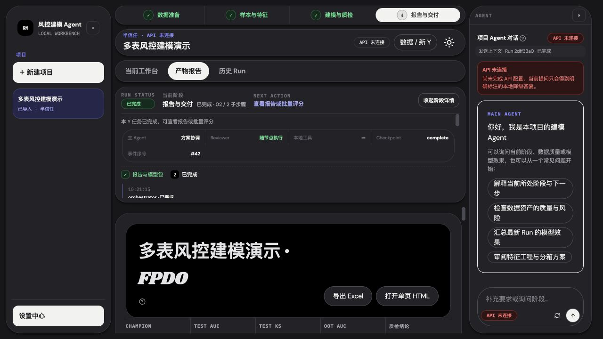
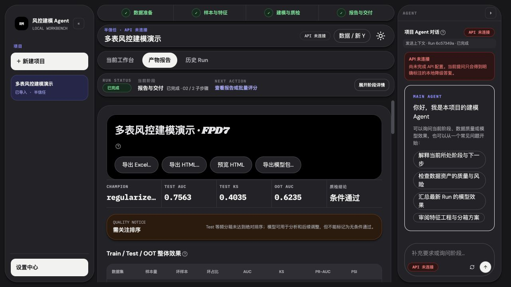
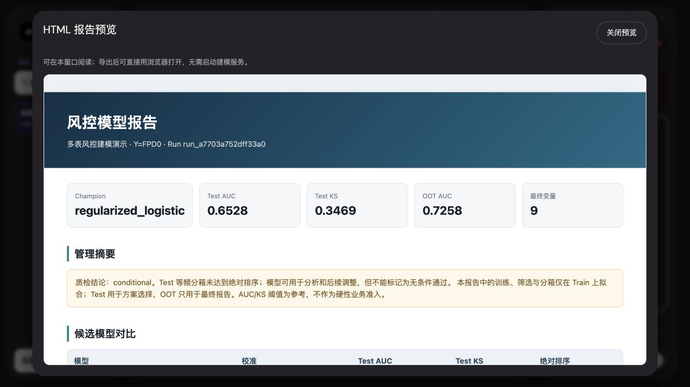

# 2026-09-08 导出与建模流程优化记录 · 1.2.3

本次针对 Excel 指定文件夹保存、HTML 导不出或打不开，以及建模步骤衔接不顺畅的反馈进行修复。在 1.2.2 全项目审计之后继续检查实际操作路径，并补充数值分箱正确性修复。

## 范围与验证方式

- 基线：`2a45f20fa5f4c551120d1d92fb174f82ecf1e883`；修复分支 `codex/export-and-modeling-flow`。
- 先在 1280×720 的实际应用界面走完六个半信任确认阶段，再结合接口、代码、负向测试和产物复读定位问题。
- 所有测试使用临时工作区与固定种子合成数据。未使用真实客户记录，也未调用外部 LLM；Reviewer 明确显示本地降级。合成数据模型的指标不是生产效果或真实 Agent 评测结果。
- 健康度标记：可用表示本次检查范围通过；需注意表示仍有明确使用条件。不是主观量化流畅度分数。

## 修复与优化

| 编号 | 原问题及影响 | 本次处理 | 验证 |
|---|---|---|---|
| E-01 | Excel 依赖浏览器下载，无法指定保存文件夹 | 原生系统目录选择器与手工路径输入；保存成功显示文件名、完整路径；复用跨端口界面偏好记住目录 | 界面保存到中文带空格目录，重新读取 XLSX 五个工作表 |
| E-02 | HTML 使用新窗口和 Blob 临时地址，内嵌浏览器中无响应或白屏 | 分开“导出 HTML”和“预览 HTML”；预览使用本机稳定地址与无脚本沙箱，导出为独立单文件 | 实际界面可见完整报告；导出字节与原产物哈希一致 |
| E-03 | HTML 内嵌 JSON 使用 HTML 实体转义，字段中的 `&`、`<`、`>` 会失真 | 用 JSON Unicode 转义保留原文，同时阻止闭合 script 标签 | 包含中文、特殊字符与恶意标签的测试可无损读取 |
| E-04 | 模型包缺少便捷出口，评分 CSV 仍依赖浏览器下载 | 模型包和评分结果统一支持指定目录导出 | 合成模型包、600 行评分结果校验通过 |
| E-05 | 重复保存和写入失败缺少统一保护 | 排他创建、同名自动编号、写前写后哈希验证、失败清理本次残件、中文错误反馈 | 并发六次保存不覆盖；损坏源文件不落盘；模拟磁盘写入失败保留原文件 |
| F-01 | 数据准备每次停在导入页，需要重复寻找下一步 | 已有数据时定位目标页；单表“用此表建模”；多表关联明确可选 | 实际项目重新进入数据准备后直接显示当前版本目标 |
| F-02 | 单表转换或多表关联后仍选中旧数据版本 | 选中接口返回的新版本，清空旧目标选择并进入目标步骤 | 新版本自动选择；纯函数回归覆盖版本与任务约束 |
| F-03 | 任务混合多个数据版本，取消勾选后可能自动再选中 | 任务仅显示当前版本；只启动所选且可运行任务；已有任务避免重复创建 | 版本隔离、去重、运行中任务排除和取消选择回归 |
| F-04 | 批量导入或启动部分成功后，界面可能不刷新 | 即使后续失败也刷新已成功结果；有已启动任务时定位首个任务；处理期间限制重复操作 | 调用链检查、界面启动与构建检查 |
| F-05 | 确认弹窗只能批准或停止任务，无法先查信息 | 增加“稍后确认”和重新打开入口；明确等待状态；当前工作台内重开保留参数草稿 | Test 比例由 0.20 改为 0.25，收起后重新打开仍为 0.25，随后成功提交 |
| F-06 | 阶段详情自动展开、标题占据过多空间，完成后缺少交付入口 | 默认紧凑状态、缩短标题区域、事件分批展示；增加“查看报告与导出”、完成后新建 Run 与“返回当前建模” | 同尺寸前后截图和真实操作检查 |
| F-07 | 失效项目路由可能先请求不存在的会话；新建失败清空输入 | 等待项目列表确认有效 ID；缺失项目返回 404；创建失败保留表单 | 缺失项目接口回归、前端类型及状态检查 |
| M-01 | 数值箱按字符串排序，`(100, inf]` 可能排在 `(2, 10]` 前，单调判断与相邻合并错误 | 数值箱按真实区间下界排序，缺失箱单独展示；自动分箱和人工分箱共用正确顺序 | 三个负向用例先失败，修复后通过；真正非单调须提供业务例外说明 |

## 实际建模流程检查

1. **导入和关联：可用。** 单表可直接进入建模，多表先核对关联键、粒度和样本膨胀，再生成新版本。字典和评分输入不能误作建模主表。
2. **目标与有效样本：可用。** 每个 Y 独立创建任务，剔除 -1 与空值；任务与数据版本一致。
3. **诊断、清洗和切分：可用。** 确认清洗后执行；同客户隔离；时间 OOT 保持为最终评估集。
4. **筛选与分箱：可用。** 仅在 Train 拟合；敏感或泄漏字段不能人工恢复；普通恢复需业务理由；数值区间顺序已修正。
5. **方案、训练和质检：需注意结论。** 半信任节点等待人工确认；训练和调参遵守样本边界。示例任务仍有“条件通过”，界面与导出保留原因，不改成无条件通过。
6. **报告、导出和评分：可用。** 运行完成后进入报告；Excel、HTML、模型包和评分 CSV 均可保存到指定目录。HTML 的内容与样式封装在文件内。

当前流程已经形成“数据 → 目标 → 样本 → 特征 → 模型 → 质检 → 交付”的闭环。本次没有开展多人可用性实验，也没有大数据量性能基准，不能把操作减少和布局调整说成已量化提升多少性能。

## 界面证据

修复前，展开的阶段区和大标题挤占报告首屏，HTML 入口依赖新窗口：

修复后，首屏可直接操作四个导出/预览入口并查看质检结论：

HTML 直接在应用内预览：

Excel、HTML、模型包、评分结果使用一致的目录保存界面：

暂缓确认后，任务状态和继续入口清晰可见：

## 本地验证

- 后端全量 259 项：最终回归 257 项通过，2 项子进程枚举因沙箱权限失败；获准正常进程权限后两项均通过。初次修复基线全量亦通过。
- 前端 90 项测试、明暗主题对比度、类型、Lint、格式与构建通过。
- 源代码打包与桌面契约通过；契约只验证配置，不能替代 Windows 真正安装。
- 合成全流程 `run_0d9bf9384e0fa9d1` 完成，输出四种注册产物，600 行评分完成；Excel、HTML、模型 ZIP、评分 CSV 的指定中文目录保存和哈希检查通过。
- UI 实际保存的 HTML 两份内容一致，第二份自动编号；Excel 可重新打开读取五个工作表。
- HTML 应用内预览已实际显示。自动化浏览器禁止访问 `file://`，因此没有将本地双击打开标记为实际点验通过；单文件完整性、内联样式和不依赖网络资源已验证。
- 本机锁屏阻止了原生目录窗口的交互点验；已实际验证超时提示及手工输入目录后的保存。Windows 发布流水线补充真实导出目录窗口的取消返回检查，并在冻结服务和安装后客户端执行实际文件导出。
- 无外部 LLM 覆盖，无生产效果声明。保留一条上游 Starlette/httpx 弃用提示。

## 升级说明

- 升级至 1.2.3，无数据库 Schema 变更，无需清空项目。
- 导出时先选择文件夹或粘贴完整路径，再点击“保存文件”；同名文件自动编号。
- 历史报告和模型包是冻结产物，不会被本次升级重写。要获得修正后的数值分箱与模型结果，请在完成页点击“基于同一 Y 新建 Run”，重新确认方案并建模。
- “稍后确认”只暂缓当前节点，不等于批准，也不继续训练。当前工作台内重开保留草稿；切换项目或重新加载页面的未提交草稿不保证持久化。

## 发布验收

- [x] 修复、负向复现、本地回归与真实界面验收。
- [ ] GitHub 最终提交的多版本 CI。
- [ ] 同一提交的 Windows / macOS 冻结构建。
- [ ] Windows 安装、迁移、恢复、建模、评分、导出、退出与卸载保留验收。
- [ ] 安装包、Manifest、体积、哈希和公开下载独立核验。

发布完成后在本节补充实际证据；未勾选项不代表已完成。
